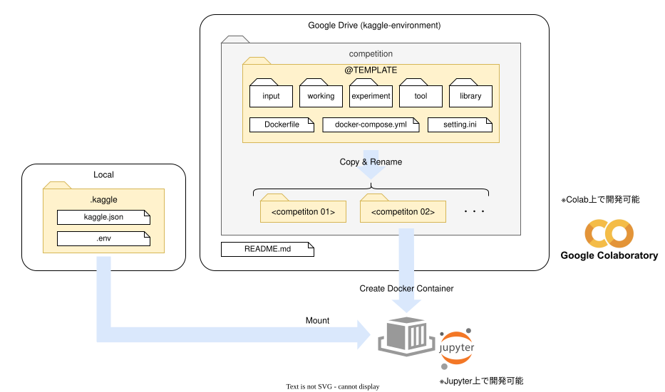

# kaggle-environment

Kaggleを模擬した環境。Colaboratory もしくは Dockerコンテナで動作させる想定の環境となる。

本リポジトリをGoogle Driveに配置することで、Colaboratoryで開発することができる。  
さらに、Google Driveを自分のPCに同期しておき、コンテナを起動しておくことで、コンテナ内でも開発することができる。

(軽い処理であればColaboratory、学習処理のような重い処理はコンテナで実施みたいに用途によって使い分けることができる)

## フォルダ構成

### 本リポジトリ

`competition`  
コンペティション毎の開発フォルダ配置場所。  
テンプレートフォルダをベースとして、各コンペティションの作業を実施する。

### ローカル

API情報などはGoogle Driveに配置するのはお勧めできない。  
今回はローカル環境の `${HOME}` フォルダに配置する想定とする。

> 配置場所を変更する場合、 `docker-compose.yml` でマウントするパスを変更する必要があるので適宜修正すること。

`kaggle.json`  
Kaggle APIを使用するために必要なトークン情報。  

`.env`  
その他のAPIの情報などを記載するファイル。  
ノートブック内で使用したいAPI等があればここに記載して使用する想定。
